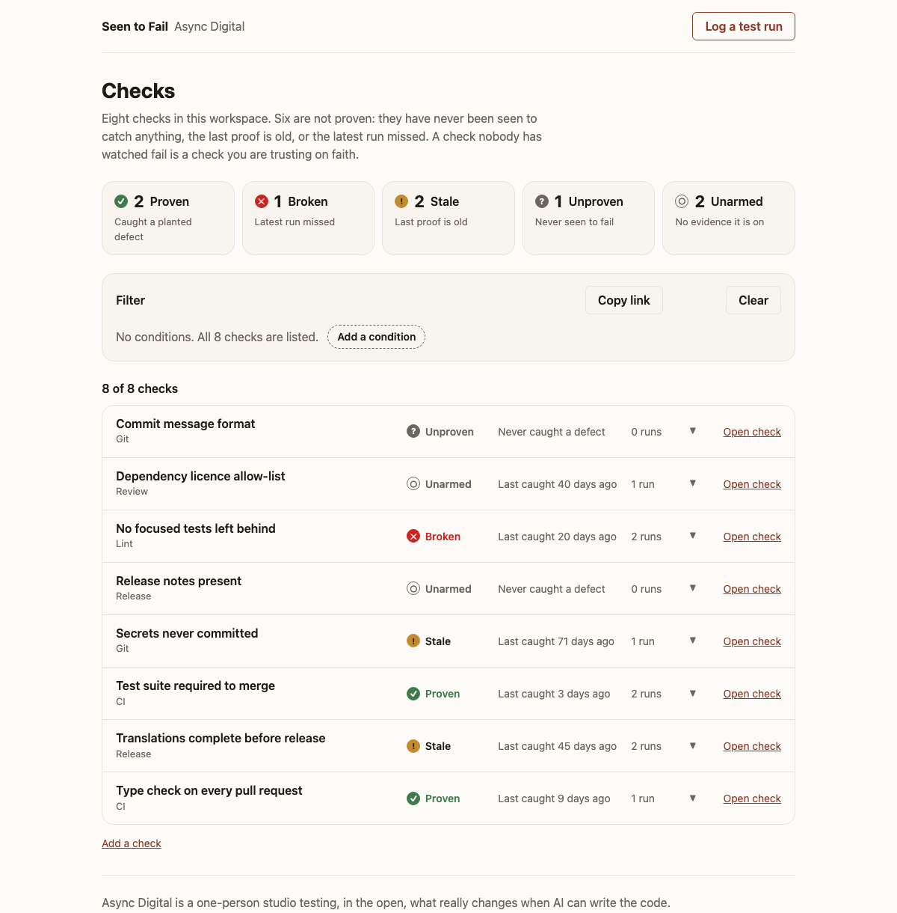
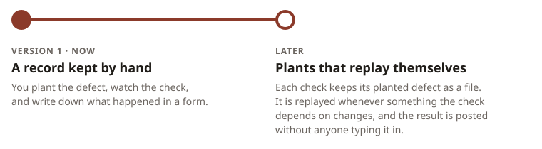

# Seen to Fail

[](https://github.com/async-digital-ltd/seen-to-fail/actions/workflows/ci.yml)

A small web app for tracking whether your automated checks have ever been seen
to catch the defect they exist for.

Lint rules, pre-commit hooks, CI gates and review bots are easy to add and hard
to trust. A check that has never reported anything looks the same whether it is
working and has had nothing to catch, or is broken and cannot catch anything.
The only way to tell the two apart is to plant the defect on purpose, watch the
check catch it, and write down what happened. Seen to Fail is that record.



Those counts are not a snapshot: the sample workspace dates every run and
observation from the day it is loaded, so `pnpm db:seed` reaches the same five
counts whenever it is run.

## How it works

Each check has a log of **test runs**. A test run is one planted defect, and
records:

- what was planted,
- what the check was expected to do,
- what it actually did: caught it, missed it, or settled nothing,
- why it settled nothing, when that is what it did,
- where it came from: somebody typed it in, or a replay posted it, and a replay
  names the commit it ran against and links the run that produced it,
- an optional note for the next person.

A run that **settled nothing** is not evidence about the check. The plant may no
longer apply to code that has moved on, the check may have been failing before
anything was planted, or it may never have run at all. None of those is the
check missing a defect, so none of them belongs in the status rules: a run that
settled nothing is counted separately, is never a catch or a miss, and leaves
the status exactly where it was. What it changes is how old the evidence behind
that status is, and a check's page says so, alongside the day of the last run
that did settle something.

The reason is shown as whoever recorded it wrote it, rather than sorted into a
category. Only one of the situations above means the plant needs rewriting, and
the tool that scores a replay separates them inside an English sentence, so a
category here could only be recovered by matching prose and a wrong match would
send a reader to rewrite a plant that is fine.

Where a run came from is recorded beside it and read by none of the status
rules. A replay and a run somebody typed in, with the same outcome on the same
day, leave a check reading the same thing. It is there so that a reader can
tell a proof that keeps itself from one somebody remembered to write down,
which is a different question from whether the check works.

It also has a log of **arming observations**: dated evidence that the check was,
or was not, switched on at all. A check can be configured and not running, and a
log of planted defects alone cannot tell that apart from a check nobody has got
round to planting anything for, so the two are recorded separately.

A check's status comes from those two logs, not from anyone's opinion of it.
There are five, and they are read in order: the first rule that matches is the
status.

Every "run" below means a run that settled something. A run that settled
nothing is not read by any of these rules, in any of their branches.

| Status       | The rule                                                                                                                       |
| ------------ | ------------------------------------------------------------------------------------------------------------------------------ |
| **Unarmed**  | There are no runs and nothing says it is on, or the latest observation says it is off and is dated on or after the latest run. |
| **Broken**   | The latest run missed the defect that was planted for it.                                                                      |
| **Proven**   | The latest run caught its defect, at most 30 days ago.                                                                         |
| **Stale**    | The latest run caught its defect, but longer ago than that.                                                                    |
| **Unproven** | There are no runs, and the latest observation says it is on.                                                                   |

Because the rules are read in that order, a check that caught a defect and was
then seen switched off reads Unarmed rather than Proven, and a check that caught
and then missed reads Broken rather than Stale. A check whose plant has stopped
applying keeps the status its last real run gave it, and the thirty-day rule
below is then the only thing that can move it, which is the backstop doing the
job the replays have stopped doing. An observation dated the same
day as the latest run counts as the later of the two, because a day is the
finest grain either fact is recorded at and there is nothing to order them by
within one.

"Latest" otherwise means by the day it happened, and then by what the run says:
a miss on a day outranks a catch on the same day. The same reason is behind
both. A run is dated to a day and nothing finer, so two runs on one day carry no
record of which came first, and a check seen to let a planted defect through
that day is broken whether or not something else it was asked about that day
went well. Ordering the two by when they were typed in would pick by clerical
order rather than by anything that happened; ordering them by the day alone
would leave it to the database. A run that settled nothing ranks below both,
which is consistent with the rules above ignoring it entirely: it sorts last
within its day, so the first run in a check's log is the run its status was read
from.

Thirty days is the one judgment in the model, and it is one constant,
`STALE_AFTER_DAYS`, in one module. A catch exactly thirty days old still reads
Proven, and one day older reads Stale. Moving that line is changing the constant
and nothing else.

The status is worked out in one place, the `check_summaries` SQL function. It
takes the day it is reading as of and the threshold as parameters and never
reads the clock, so the same rows always give the same answer. That day drives
the staleness arithmetic only: a run or an observation dated after it still
counts, so reading the workspace as of last Tuesday asks how old a catch would
have been then, rather than what the record looked like then.

Each check also records what it protects and how you can tell it is switched on.
Either may be left blank, because a check nobody has written a tell for is
exactly the thing this product exists to make visible.

## Filters

The list of checks can be narrowed with a filter such as
`(status is Unproven OR status is Stale) AND area is Git`, which picks two of
the eight checks in the sample workspace.

A filter is a typed tree of conditions, and the language is closed on purpose:
four fields, a fixed set of operators for each, and exactly two levels of
grouping. The conditions in a group share one joiner and the groups share
another, so there is no precedence to work out.

| Field        | Operators               | Argument                                                  |
| ------------ | ----------------------- | --------------------------------------------------------- |
| `status`     | `is`, `isNot`           | one of `Unarmed`, `Broken`, `Proven`, `Stale`, `Unproven` |
| `area`       | `is`, `isNot`           | text                                                      |
| `lastCaught` | `never`                 | none                                                      |
| `lastCaught` | `before`, `after`       | a whole number of days                                    |
| `runs`       | `moreThan`, `fewerThan` | a whole number of runs                                    |

The filter lives in the page's address, so a refresh, the back button and "Copy
link" all keep it, and a filter is shared by sending that link. The example
above is this one:

```
/?f=and!or*status.is.Unproven*status.is.Stale!and*area.is.Git
```

The grammar spells the language out rather than encoding it. Its alphabet is
exactly the set `encodeURIComponent` leaves untouched, so a link pasted into a
chat window stays legible, every filter has one link rather than several, and
parsing a link gives back the filter it was written from.
`packages/filter/README.md` sets the grammar out in full.

Values are compared exactly as they are written. The sample workspace spells its
areas `CI`, `Git`, `Lint`, `Release` and `Review`, so `area.is.git` matches
nothing.

Changing the filter pushes a history entry rather than replacing one, so back
and forward step through the filters that were built. A change that leaves the
filter as the address already reads it adds no entry, so one press of back
undoes one thing.

`f=all` is accepted on the way in and means the filter that hides nothing. The
app never writes it: the list nobody has narrowed is the bare address `/`.

A filter is validated where it enters the API, by the same reader that reads a
link, and only then compiled into SQL. Every value a filter carries reaches the
database as a bound parameter, so nothing in it is ever concatenated into a
query, and a filter the language cannot express is refused before the resolver
has touched the database.

That compiler is the core of the project, and it is tested accordingly: every
filter the app can express must compile to the query it means, and every shared
link must parse back into the same filter.

## Stack

- **TypeScript** throughout, in strict mode.
- **GraphQL** API on Node, with frontend types generated from the schema.
- **PostgreSQL**, with four tables: checks, test runs, arming observations and
  saved filters. The schema carries `saved_filters` for saving a filter under a
  name, and nothing reads it yet.
- **React** with Vite, React Router and urql.
- **Vitest** for tests, and GitHub Actions for type checking, linting, format
  checking, tests and a build of the client.

The server is built for local use only. There is no per-request cost limit and
no limit on the size of a request body, so it is not hardened for deployment.

The list, the filter bar and the three forms carry keyboard tests. A check's own
page does not, and no dedicated keyboard and screen reader pass has been run
over any of them.

## Run it locally

Requires Node 24 or newer, the version in `.nvmrc`, pnpm, and a PostgreSQL 16.

```sh
pnpm install
cp .env.example .env
```

`.env` holds `DATABASE_URL` and `TEST_DATABASE_URL`. The server reads both
through one config module and stops with the name of the variable if either is
missing, so there is nothing to guess at.

### The database

Any PostgreSQL 16 reachable at those two URLs will do. There are two routes
here, and you want one of them, not both, because they would compete for port 5432.

**Homebrew, the route this project is developed on.** `pnpm db:up` starts
`postgresql@16` as a service and creates the two databases named in `.env` if
they are not there yet. `pnpm db:down` stops it. A server started this way has
no `seen_to_fail` role and no password, so the values in `.env.example` will not
reach it as they stand. It does let in the user you are logged in as, and a URL
with no user in it connects as that user, so take the user and password out of
both URLs altogether:

```sh
DATABASE_URL=postgresql://localhost:5432/seen_to_fail_dev
TEST_DATABASE_URL=postgresql://localhost:5432/seen_to_fail_test
```

**Docker, provided but unproven.** `docker compose up -d` starts the compose
file's PostgreSQL 16 with both databases and the credentials `.env.example`
already carries, which makes it the easier route on most machines. It has not
been run here, on a machine with no Docker installed, so treat it as unverified
until someone reports otherwise.

Either way, apply the migrations:

```sh
pnpm db:migrate
```

Migrations are numbered plain SQL files in `packages/server/migrations`. The
runner applies them in filename order and records each one in a
`schema_migrations` table, so running `pnpm db:migrate` again applies nothing
and says so. `pnpm db:reset` drops the development database, creates it again
empty and reapplies every migration. It leaves the test database alone.
`packages/server/migrations/README.md` is worth reading before writing one: it
holds the trap this schema has fallen into twice, which is that a check
constraint passes on null and is therefore vacuous for exactly the rows it
exists to refuse.

```sh
pnpm db:seed
```

Loads the sample workspace of eight checks in the screenshot above, which is
what lets all five statuses be seen working before there is a real record behind
any of them. Every check, run, observation and note in it is invented for this
project and describes no real team's tooling. It empties the four tables before
it inserts, so running it again replaces the workspace rather than failing, and
it only ever points at the development database.

### The server

```sh
pnpm dev:server
```

Serves GraphiQL at `http://localhost:4000/graphql`, where the schema and its
queries can be read and run. There is a liveness route at `/health`, which
answers whenever the process is up, and a readiness route at `/ready`, which
answers only once the database does.

### The client

```sh
pnpm dev:web
```

Serves the app at `http://localhost:5173` and proxies `/graphql` to the server,
so the server has to be running too. `pnpm build:web` writes the production
bundle to `packages/web/dist`.

The home page lists the checks under their status tiles, and a tile narrows the
list to its status. The filter bar between the two builds a filter condition by
condition. Each check has its own page, which is where an arming observation is
recorded. Runs are logged through a form.
A check is added through a form of its own.

## The published ledger

Nothing is hosted. The app above is for running locally; what gets published is
a record rather than a service.

A run reaches that record by being committed. `ledger/` holds one JSON file per
check, run and arming observation, and a build turns those files into a static
page. The database and the status rules do not go away: the records are loaded
into PostgreSQL, every status comes back out of the same `check_summaries`
function the running app reads, and the page is rendered from what that
produced. They run inside the build instead of behind a URL.

```sh
pnpm ledger:validate   # refuse a record that breaks a rule
pnpm ledger:build      # build dist/ledger from the records
```

`ledger/README.md` sets the record's shape out in full.

The write path is a commit, so a run that is wrong has an author and a diff, and
can be reverted like anything else in the history. The author and the diff are
real and you can read them: `git log -- ledger/` is the history of every record
this project has written about itself. The revert is a property of git rather
than
something this repository has exercised. No run has been reverted, so the revert
is the part of that sentence to read as untested.

What nothing holds is a long-lived token against a running instance, because
there is no instance to write to. A job that records a run needs write access to
this repository and nothing else. Both workflows below run on the short-lived
`GITHUB_TOKEN` the runner is handed, with `contents: write` to commit and push,
and there is no secret to leak, rotate or scope: what a job writes is a commit
on a branch that a person then has to merge.

### A run recorded by hand

`Record a run` (`.github/workflows/record-run.yml`) is the job's half of the
manual route. It takes the result somebody watched, refuses a malformed one
before anything is written, commits the record and pushes a branch.

The watching has a lane of its own. CI runs on every push to a branch under
`ci-control/` as well as on `main` and on pull requests, which is where a defect
gets planted against this repository's own CI: branch, plant it, push under
`ci-control/`, read the conclusion, delete the branch. Keeping the lane in the
shipped workflow means what goes red is the workflow that really runs on `main`
rather than a variant edited to be reachable. The badge at the top of this file
is pinned to `main`, so a red control run cannot paint it red.

### A replay, start to finish

One check is replayed by a job: `ci-type-check`. It is the only check with a
plant declared, and the next section says plainly what that means for the other
eight.

The replaying is not this project's work. [`canfail`](https://pypi.org/project/canfail/)
0.2.1 does it: handed a declaration of planted defects, it runs the check on a
clean tree first, applies each declared break in turn, runs the check again, and
scores what happened. The version is pinned in the workflow, because an
unpinned install would let the scoring change under a ledger that cannot yet see
which version produced a verdict
([#101](https://github.com/async-digital-ltd/seen-to-fail/issues/101)).

What this project adds is everything after the verdict. `canfail` answers
whether a check caught a defect just now, and then forgets. The ledger answers
whether the check has ever been seen to catch one, how long ago, and whether
anything has changed since: a record per planted defect, a history per check, a
status read off that history by one SQL function, and a proof that goes stale.

The declaration is `canfail.json` at the root, in `canfail`'s own format. This
project defines no format of its own. Two keys sit beside each check that
`canfail` ignores and this project reads:

```json
{
  "name": "Type check",
  "checkId": "ci-type-check",
  "dependsOn": ["packages", "tsconfig.base.json", "pnpm-lock.yaml"]
}
```

`checkId` is the check's address in the ledger and the only way anything outside
the app names a check. `dependsOn` is the paths that bear on the check's proof,
spelled as git spells them, relative to the root; an entry matches a changed
path when it is that path or when the path sits inside it. `canfail`'s own keys
sit beside these two, and `canfail.json` carries the full list and both declared
breaks.

The job is `.github/workflows/replay.yml`. It runs weekly, on Mondays at 04:17
UTC, and can also be dispatched by hand, which is the route for a check that has
gone stale with nobody having touched anything it depends on. Weekly rather than
on every push for two reasons, and the second is the stronger: each replay runs
the check once on a clean tree and once per declared break, which costs runner
minutes this project has no budget for, and a replay filed on every merge would
bury the runs that say something under runs that say the same thing again.
Weekly also sits well inside the thirty-day backstop, so a change is noticed
within seven days with twenty-three days of margin left. The replay is
deliberately not part of the CI workflow that runs on every pull request:
`canfail` edits real source files on disk and restores them, which is fine on a
runner nobody else is using and is not something to put in the path of every
contributor's change.

The job does six things:

1. **Works out which checks are due**, with `pnpm replay:select`. It exits 0
   when something is due, 3 when nothing is, and 1 when it refuses, and the
   workflow reads that status rather than looking for an output file, because a
   missing file cannot tell a refusal from an honest empty answer.
2. **Installs `canfail` 0.2.1 and runs it** over the declaration, writing the
   report under the runner's temporary directory rather than into the checkout.
3. **Checks the tree came back.** `canfail` edits real files and puts them back,
   and a restore that ran is not a restore that worked: a tree that did not come
   back leaves every break after the failed one scored against a tree nobody
   declared, so the job stops instead of recording them.
4. **Records what the report means**, with `pnpm ledger:replay`. One run per
   declared break, each carrying `source: replay`, the commit the plants were
   applied to, and a link to the run that produced it.
5. **Validates the whole ledger**, with the same `pnpm ledger:validate` that CI
   and the hand-recording workflow run, so this job cannot commit a ledger
   either of them would have refused.
6. **Pushes `replay/<run id>` and says what is waiting**, printing the
   `gh pr create` command into the run summary. It does not open the pull
   request. A green run here means recorded and waiting for a person; it does
   not mean done.

The mapping from a verdict to a record is fixed, and those four verdicts are the
whole vocabulary of 0.2.1:

| `canfail` verdict | the ledger records | `inconclusiveReason`   |
| ----------------- | ------------------ | ---------------------- |
| `catches`         | caught             | none                   |
| `blind`           | missed             | none                   |
| `wrong-failure`   | inconclusive       | `canfail`'s own words  |
| `look`            | inconclusive       | `canfail`'s own words  |
| anything else     | nothing is written | the whole report stops |

A fifth verdict means the mapping is out of date, which is a refusal naming it
rather than a guess, and it stops the whole report rather than the one outcome:
a tool this mapping no longer describes did not produce the other verdicts any
more reliably. The reason is copied word for word rather than reworded, for the
reason the status model gives above.

**What that produced.** Run
[35429662430](https://github.com/async-digital-ltd/seen-to-fail/actions/runs/35429662430)
replayed both declared breaks against `62e34e9` on `main` on 19 September 2026.
`canfail` scored both `catches`, the adapter wrote two `caught` runs, the job
pushed `replay/35429662430`, and a person opened
[#103](https://github.com/async-digital-ltd/seen-to-fail/pull/103). The two
files it added are in the record now, and one of them reads:

```json
{
  "checkId": "ci-type-check",
  "runOn": "2026-09-19",
  "planted": "STALE_AFTER_DAYS is written as a string rather than a number.",
  "expected": "The type check fails.",
  "outcome": "caught",
  "inconclusiveReason": null,
  "note": null,
  "source": "replay",
  "sourceCommit": "62e34e977f2241cbe33b948cc31afd287b5420ed",
  "sourceRunUrl": "https://github.com/async-digital-ltd/seen-to-fail/actions/runs/35429662430"
}
```

**And the half that matters more.** A route that records a catch is worth
nothing until the same route has been seen not to record one. Run
[35431432957](https://github.com/async-digital-ltd/seen-to-fail/actions/runs/35431432957)
ran the same replay against `ci-control/67-red-baseline` at `7d7e24c`, a branch
where the type check was already failing before anything was planted. That the
baseline really was red, and red for the declared reason, is CI run
[35431434499](https://github.com/async-digital-ltd/seen-to-fail/actions/runs/35431434499)
on the same branch, which concluded failure with `Type check` the step that
failed. `canfail` scored both breaks `look`, the adapter wrote two
`inconclusive` runs carrying `canfail`'s own sentence as the reason, and no
`caught` run was written. `canfail` exited 0 in both halves, so the process
status could not have told the two apart; the records did, which is why the
observation is the absent `caught` row and not an exit code. Those two records
describe that control branch rather than `main` and were left on
`replay/35431432957`, which is why `ledger/runs/` holds no inconclusive run.

**Neither workflow opens its own pull request.** GitHub Actions is not permitted
to create pull requests on this repository. `Record a run` still tries, so it
ends red at that last step with the record already committed and pushed:
measured on 18 September 2026 in run
[35405970369](https://github.com/async-digital-ltd/seen-to-fail/actions/runs/35405970369),
which failed with `GitHub Actions is not permitted to create or approve pull
requests (createPullRequest)`. `Replay a plant` does not try, and pushes the
branch instead. The switch that would allow either of them, "Allow GitHub
Actions to create and approve pull requests", is off, and it couples creating to
approving: turning it on to let a job open a pull request also lets automation
approve one, in a repository whose whole subject is whether automated checks can
be trusted to have been checked. Tracked at
[#74](https://github.com/async-digital-ltd/seen-to-fail/issues/74), which also
holds the cost of a red run that has already recorded something. The automatic
half is not automatic end to end until that is settled.

### How much of this record is automatic

One of the nine checks in `ledger/checks/` is replayed by a job. The other eight
are not, and the whole difference is one file: `canfail.json` declares a plant
for `ci-type-check` and for no other check.

| Checks                                                                       | What their record rests on                                                                                                                                       |
| ---------------------------------------------------------------------------- | ---------------------------------------------------------------------------------------------------------------------------------------------------------------- |
| `ci-type-check`                                                              | A declared plant, replayed by the workflow above. Its two most recent runs came from one.                                                                        |
| `ci-published-output`, `ledger-export-agreement`, `ledger-record-validation` | Runs somebody planted, watched and typed in. Nothing replays them, so the thirty-day rule is the only thing that will ever move them.                            |
| `ci-build-web`, `ci-codegen-check`, `ci-format-check`, `ci-lint`, `ci-test`  | An arming observation and no run at all. By the rules above that reads Unproven, which is the honest status for a check nobody has planted anything against yet. |

You can check that with `ls ledger/checks`, `ls ledger/runs` and `cat
canfail.json`, and the arithmetic is the point of showing it: a quarter of the
checks that have any run behind them are replayed, and one ninth of the checks
on the page are.

None of that is a promise that broke. Epic
[#62](https://github.com/async-digital-ltd/seen-to-fail/issues/62) scoped the
automatic half to adapting an existing runner against real checks here, and
names writing plants automatically, a runner of this project's own, and checks
that cannot be broken on purpose at all as out of scope. It is said here rather
than left to be worked out because a reader who discovers the reach of a thing
for themselves, after the page implied more, is right to stop believing the rest
of the page.

### What the build refuses to publish

The build refuses to publish when the records and the output disagree: it
compares the files on disk with the rows the database ended up holding, with the
export, and with the rendered page, and writes nothing if any of those disagree.
A page listing nine runs where the ledger holds ten looks exactly like a page
listing ten, which is the kind of quiet wrongness this project is about.

The page names the commit that recorded each run, read back out of the history
rather than stored, so a run cannot claim a commit that did not add it. That is
a different commit from a replay's `sourceCommit`, which is the tree the plant
was applied to, and the page names both rather than leaving them to be told
apart by position.

The published page is read-only and has no filter bar. The filter language
compiles a filter to SQL, and there is no database behind a published page to
compile it against, so it is what you get when you run the app locally. That was
the cheapest of the three ways and it is the one that hides the best part; the
cost is bought back by
[#73](https://github.com/async-digital-ltd/seen-to-fail/issues/73) rather than
absorbed.

**The forms have not gone anywhere.** They and the GraphQL mutations are still
how a run is recorded against a workspace you are running locally, and they are
still where a check is added and an arming observation recorded. What has
changed is that they are no longer the only way a run is recorded, and they do
not write the published ledger. Nothing yet carries a run from a local database
into `ledger/`
([#75](https://github.com/async-digital-ltd/seen-to-fail/issues/75)).

**Nothing is published yet, on purpose.** CI builds the page on every run it
does, which is every pull request and every push to `main`, and keeps it as a
build artefact for seven days. GitHub Pages is switched off on
this repository: `GET /repos/async-digital-ltd/seen-to-fail/pages` answers 404,
which is how that can be checked from outside without changing anything.

A Pages site cannot be private on the plan this organisation is on.
`gh api /orgs/async-digital-ltd` returns `plan: team`, and private Pages needs
Enterprise Cloud, so the conclusion follows from the plan alone. An attempt to
enable one with `public=false` was refused with `422 Current plan does not
support private GitHub Pages` on 18 September 2026. That 422 was observed once
and has not been reproduced, and deliberately will not be: reproducing it means
enabling Pages, which is the one thing that must not happen before the
visibility decision. The plan is the receipt, and it is a read anybody can
repeat.

The decision does not rest on that number anyway. Turning Pages on would make
the ledger readable by anyone with the URL before the decision to make the
repository public has been taken, and it would put the output outside the
history review that
[#55](https://github.com/async-digital-ltd/seen-to-fail/issues/55) exists to
hold. Serving it is
[#76](https://github.com/async-digital-ltd/seen-to-fail/issues/76). Whether the
build needs changing when that happens has not been tested: no Pages site has
been enabled here and nothing has been deployed, so the most that can be said is
that the artefact CI already produces on every push is the thing that would be
served.

## Tests

```sh
pnpm typecheck
pnpm lint
pnpm format:check
pnpm test
```

The repository is a pnpm workspace with four packages:

- `packages/server`, the GraphQL API,
- `packages/web`, the React client,
- `packages/filter`, the filter language, imported by both sides so that
  neither one depends on the other,
- `packages/replay`, which reads a replay tool's report and says what runs it
  means. It writes nothing, reads no files and knows nothing about a database.

`typecheck` and `test` run inside every package. `lint` and `format:check` run
once over the whole tree from the repository root. `pnpm format` rewrites files
in place instead of reporting on them.

The server's resolver types and the client's typed queries are generated from
`packages/server/schema.graphql` and checked in. After changing the schema or a
`.graphql` query in `packages/web`, run `pnpm codegen`. CI runs
`pnpm codegen:check`, which regenerates both and fails when the result differs
from what is committed.

Some tests are backed by the database. They run against `TEST_DATABASE_URL` on
a real PostgreSQL, apply the migrations before the first of them, and empty
every table between tests, so they are repeatable without anyone tidying up by
hand. They fail if no database is running, which is the honest answer rather
than a quiet skip. The status rules above are tested that way, one fixture per
rule, so a rule deleted from the SQL takes at least one test down with it.

CI runs `pnpm codegen:check`, applies the migrations, runs the four commands
above, and then `pnpm build:web`, which is what proves the page reaches the
code: the tests import modules, and only the bundler starts from `index.html`.
It finishes by reading the ledger and building the published page from it, and
checking what came out: two files, naming the commit CI is running against, with
no script in them.

## Licence

MIT, in `LICENSE` at the root of the repository.

## How it is built

The code in this repository was written by Claude, an AI coding agent, under
the owner's direction. The owner set the scope, the status model and the rulings
recorded in the issues, and checked the work, but did not write the TypeScript.
The sample data is invented.

Code written that way is only as trustworthy as the checking behind it, so here
is what was checked, what was not, and where the evidence for each is.

- **Planted defects, watched being denied.** Tests were trusted once the defect
  they exist for had been planted and seen to fail them. On the story that built
  the add-check form, 12 defects were planted and all 12 were caught ([#24](https://github.com/async-digital-ltd/seen-to-fail/issues/24)).
- **The fault none of them could see.** That same branch built only one of the
  two entry points its ticket named. The planted defects, a code review and the
  acceptance check all passed it, because each examined what the branch
  contained and the fault was something missing. It was caught when the README
  screenshot, retaken from the branch and expected to show the new link, came
  back byte-identical to the one before
  ([#24](https://github.com/async-digital-ltd/seen-to-fail/issues/24)).
- **A scanner trusted only after it fired.** The whole history was scanned for
  secrets with gitleaks before the repository was made public, and the clean
  result counted only once the same scan had reported a planted key
  ([#29](https://github.com/async-digital-ltd/seen-to-fail/issues/29)).
- **A walkthrough by hand.** The run instructions above were followed from a
  fresh clone. Every command worked, and one sentence led a Homebrew reader into
  database URLs the server refuses, which CI had no way to notice
  ([#27](https://github.com/async-digital-ltd/seen-to-fail/issues/27),
  [#48](https://github.com/async-digital-ltd/seen-to-fail/pull/48)).
- **The ledger's own guards, watched refusing.** The two checks the publishing
  route rests on were each given the defect they exist for and seen to deny it:
  a record whose outcome was neither caught nor missed, which the validator
  refused with a non-zero exit, and a record dropped from the export inside the
  build, which the build refused to publish, leaving no output directory behind.
  Both were watched passing before and after. They are the first runs in
  `ledger/`, which is the first thing this project has recorded about itself
  ([#63](https://github.com/async-digital-ltd/seen-to-fail/issues/63)).
- **A guard that could not fail, in a repository about guards that cannot
  fail.** The CI step that refuses a published page carrying a script was first
  written as `! grep -qi '<script' ...` under `set -e`. A shell does not apply
  `set -e` to a command whose status is inverted, so that step went green with
  the script sitting in the page. It was found by planting the script and
  watching the step pass, before it had run anywhere, and rewritten as an `if`
  ([#63](https://github.com/async-digital-ltd/seen-to-fail/issues/63)).
- **A test that depended on the shell.** The error masking tests passed or
  failed with the value of `NODE_ENV`. They were run under each value, seen
  failing under one, and the server was pinned so they no longer depend on it
  ([#39](https://github.com/async-digital-ltd/seen-to-fail/issues/39),
  [#56](https://github.com/async-digital-ltd/seen-to-fail/pull/56)).

Not checked:

- No keyboard and screen reader pass has been run
  ([#28](https://github.com/async-digital-ltd/seen-to-fail/issues/28)).
- Nothing automated exercises the client and the server together. That path
  was walked by hand once, over HTTP, on 16 September 2026
  ([#46](https://github.com/async-digital-ltd/seen-to-fail/issues/46)).

## What shipped, and where it could go

<picture>
  <source media="(prefers-color-scheme: dark)" srcset="docs/roadmap-dark.svg">
  
</picture>

**Version 1 is manual, and eight of the nine checks recorded here still are.**
Proving one check means making a throwaway branch, breaking the code in the way
that check exists to catch, running the check, confirming it failed for that
reason and not another, deleting the branch, and then writing down what
happened. The app holds the record. Every step that produces the record is
yours.

That is the weakness, and it is the one the app exists to show in checks: a
record made that way goes stale as soon as people stop doing all of it. Thirty
days is only a stand-in for what actually voids a proof, which is a change to
something the check depends on: its workflow, its configuration, the version of
its tool.

**Version 2 automates all of that except deciding what to break, for a check
that has a plant declared.** You write the breaking change once and keep it
beside the code, with the list of things its check depends on. A job applies it,
runs the check, confirms it failed for that reason, puts the code back and
records the result. Nobody opens the app. You write the plant in the format of
the tool that replays it rather than in one this project invents, and what this
project adds is the record. That is not a direction any more: it is
`canfail.json`, `.github/workflows/replay.yml` and the ledger section above,
and it has been through the whole route on `ci-type-check`.

**What is still only a direction** is the rest of the reach, and it is worth
being specific about which parts:

- **The other eight checks.** A plant is written once, by a person, and nothing
  writes one for you. Epic
  [#62](https://github.com/async-digital-ltd/seen-to-fail/issues/62) names
  writing plants automatically as out of scope, so until somebody writes them,
  eight of the nine are proved by hand or not at all.
- **A runner of this project's own.** An existing one was adapted rather than
  written, and writing one is only worth it if the adapter shows the ledger
  earns its keep and the tool cannot be made to fit.
- **A record that knows which tool produced a verdict.** The version is pinned
  in the workflow and named in this file, which is prose rather than record: the
  ledger cannot yet tell you that a run was scored by `canfail` 0.2.1
  ([#101](https://github.com/async-digital-ltd/seen-to-fail/issues/101)).
- **End to end without a person.** Both recording workflows stop short of
  opening their own pull request
  ([#74](https://github.com/async-digital-ltd/seen-to-fail/issues/74)).
- **Plants that need a branch pushed and another workflow's verdict awaited.**
  Everything here replays in place, on one runner, in one job. Anything else is
  a later epic if in-place replays prove useful.

Some checks cannot be broken on purpose in any of those ways, a review bot or
branch protection among them. Those stay manual. Thirty days stays too, as a
backstop for changes nobody thought to list, so if the automatic runs stop
arriving, Proven checks still drift to Stale.
